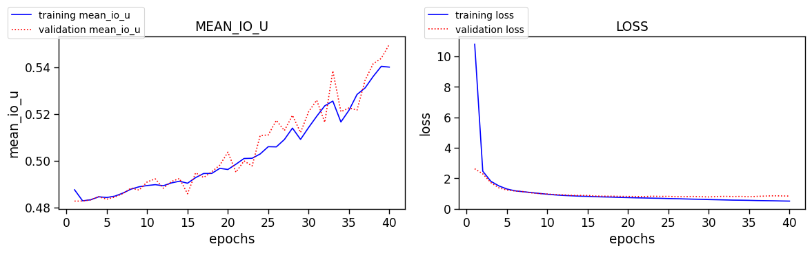
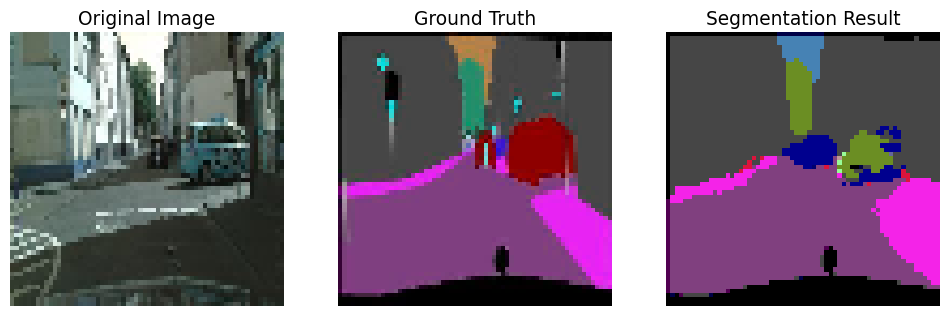
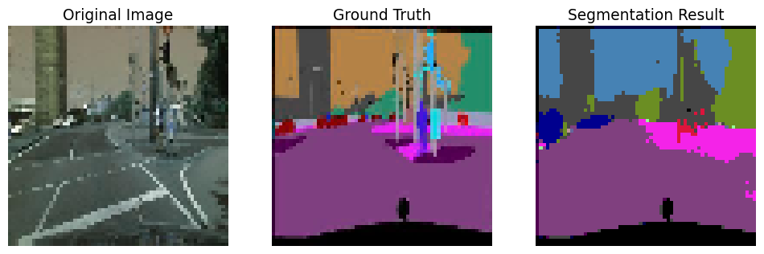
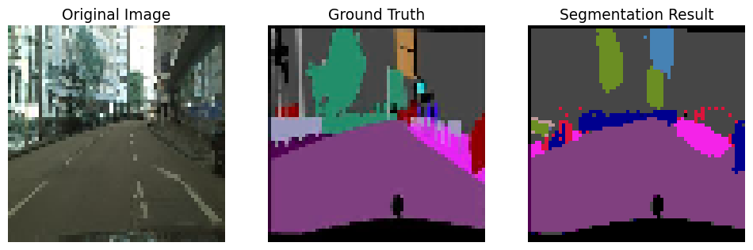
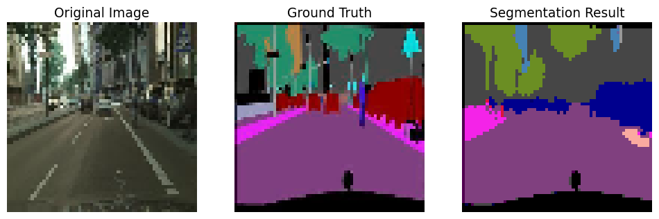
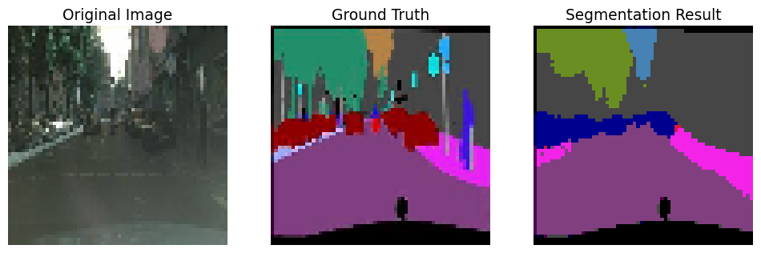

# CityScapes_Segmentation_Project
This is a project repository that segments the environment in front of the vehicle into 29 classes.

## Execution Environment
I executed this on 2 types of Environments and are like below.

- Colab Pro Plus(In this case, up to 128x128 Images were able to proceed learning)
- Local(In this case, up to 64x64 Images were able to proceed learning)
  - Windows 11 Laptop
  - GeForce GTX 1660ti(6GB of VRAM)
  - Intel i7 10750h CPU
  - 32GB RAM
  
## Dataset
I used train and validation dataset from CityScapes segmentation dataset. As far as I'm tracking, test dataset are not included. And the input data images(both train and validation) are basically 256x256 resized of original CityScapes because of computational limits. In **./train/train.ipynb**, this will resized to 128 or 64, or whatever user wants to proceed learning.

## Learning Network
I made a custom network based on [UNet](https://arxiv.org/abs/1505.04597). The channel or resolution differes from what input user gives. 

## Result
The project is still working, and I only proceeded train, validation, and applided the model to the video. There are no test sets on CityScapes, further I will get the custom validation and test sets. 

The evaluation methods that I took is **mean IoU** and **Accuracy**. Result graphs of training and validation procedure are like below.

Since there are no test datasets on CityScapes, I re-applied the processed model to some of my validation data again and the results are like below.

Keep in mind that **the ground truth images's R and B channels are inverted**, since I didn't proceed cvtColor(BGR2RGB) by mistake.
Concerning with it, the result looks pretty good, but this is re-application to the validation image again.

Also, after I got the model(.h5) file of 128x128 Images(using Colab), I applied the model to my video, which is a Euro Truck Simulator 2 Gameplay video resized to 128x128. And it is like below.

Based on the output gif above, It looks like the performance of the model is quite low and I think it's because of low resolution of Input data(caused by the lack of Computation, both on Local and Colab).
Also, In some aspect, it looks like the model is overfitted. I think I need to figure this out with a better computational environment.

## Repository Architecture
- markdown_attach: contains imgs and gifs for README.md.
- data
  - dataset: contains train/val/test folder. test is empty one. **labelIds** is an segmented ground truth for **leftImg**.
  - preprocess: contains some augmentation or resize/rename codes for datasets.
  - video_test: result videos or images will be stored here.
- model: learned model(.h5 extension) will be saved here.
- train: **train.ipynb** will load learning network from **unet.py** to proceed training of model.